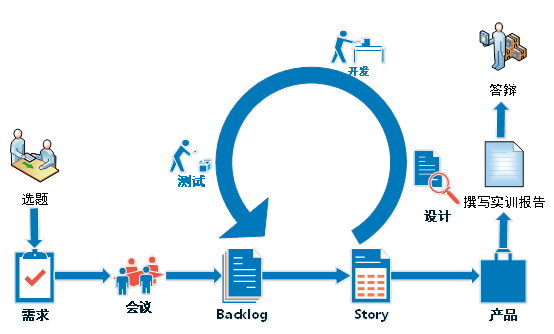
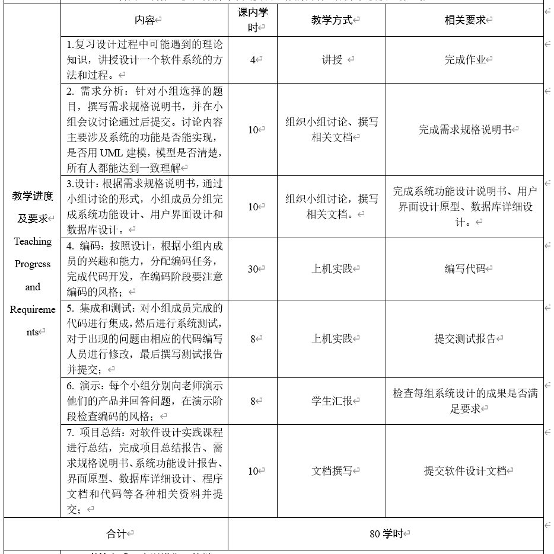
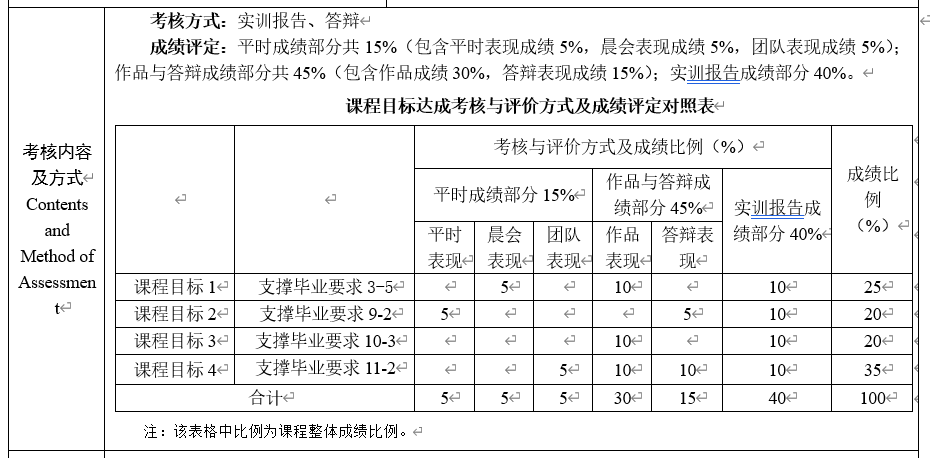
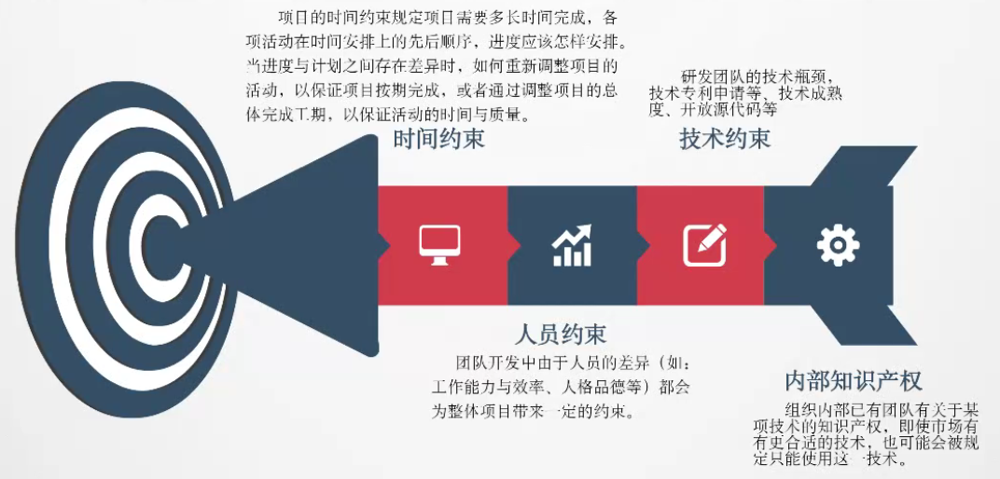

# spdss
Synthesis Practice of Data and Software Systems

## 一、实验安排
| 。  | 时间             | 安排                 |
| --- | ---------------- | -------------------- |
| 1√  | 7月11日早8：30   | 任务布置与课程须知   |
| 2√   | 7月12日早8：30   | 开发任务需求分析汇报 |
| 3   | 7月13日晚7：30   | 开发进度第一次汇报   |
| 4   | 7月15日下午2：30 | 开发进度第二次汇报   |
| 5   | 7月17日下午2：30 | 作业最终完成演示     |

## 二、实验要求——技术要求
- （一）可选的编程语言
  - 开发语言包括但不限于一下四种语言之一：Java、PHP、C#、python
- （二）后台数据库
  - 后台数据库包括但不限于：Access、SQL server、MySQL、Oracle
- （三）前后端框架
  - 建议使用框架进行开发，以加快开发速度，后端如Java的spring boot，PHP的thinkphp，前端如bootstrap、layui等。

## 二、实验要求——程序文档要求
- （一）程序
- （二）系统设计说明
- （三）界面设计
- （四）数据库设计

## 三、课程安排
- 需求分析
- 界面及数据库设计
- 。。。
- 集成和测试
- 演示
- 总结

## 四、课程考核
- 功能：是否实现了系统设计时要求的全部功能，且能正常运行。
- 代码：编码风格是否规范。
- 文档：系统设计说明、界面设计、数据库设计、测试报告、项目总结的质量是否满足要求。
- 其他：是否采用了前后端框架、系统界面

# 数据与软件系统综合实习（学分2）

## 课程目标及毕业要求
- 目标1：能够使用可视化、报告或软硬件等形式呈现设计成果。（支撑毕业要求3-5 能够使用可视化、报告或软硬件等形式呈现设计成果。）
- 目标2：能够组织、协调和指挥软件项目团队开展工作。促进团队合作、解决人员冲突、有计划地带领团队完成工作目标。（支撑毕业要求9-2 能够组织、协调和指挥软件项目团队开展工作。促进团队合作、解决人员冲突、有计划地带领团队完成工作目标。）
- 目标3： 能够将软件工程专业知识应用到撰写报告和设计文稿中，并能够就相关问题陈述发言、清晰表达或回应指令。（支撑毕业要求10-3 能够将软件工程专业知识应用到撰写报告和设计文稿中，并能够就相关问题陈述发言、清晰表达或回应指令。）
- 目标4：能够在多学科环境中运用软件工程管理原理与经济决策方法，对项目方案实施中的时间、成本、质量、风险、人力资源等进行有效管理（支撑毕业要求11-2 能够使用常用资源与工具，支持复杂软件的分析、设计与开发、测试、过程管理、 仿真模拟等环节，并理解其局限性。）。

## 教学方法
1. 实习项目讲解：主要复习实习项目中所涉及的各种理论知识，以及讲解涉及到的软件设计方法，引导学生使用这些理论知识和软件设计方法，解决实际实习项目可能遇到的问题。
2. 小组讨论：学生分为小组，每组5-7人，自行决定组长。组长召集组员讨论决定设计的选题、所用的编程语言，解决系统需求分析、系统建模、系统功能设计、界面设计、数据库设计等问题，然后根据每位同学的兴趣和能力分配系统实现方案，组织小组成员进行测试，编写各种文档，进行设计成果演示。
3. 上机实验：根据小组内分配的编程任务，编写所分配到的程序模块，协作完成程序模块的集成和调试工作。

## 基本过程
程序设计实训的基本过程如下图所示，主要分为选题、需求分析、会议讨论、Backlog（构建开发待办列表）、Story、设计、开发、测试、产品产出、撰写实训报告和答辩环节。

1. 选题：学生根据个人企业宣讲介绍和个人兴趣申报选题志愿，由软件工程教学核心组根据学生志愿协调确定最终选题。
2. 需求：导师概略描述了本轮迭代需要完成的产品功能；
3. 会议：包括需求串讲会议、Story串讲会议两类，通过群体讨论，完成需求的细化和拆分，形成产品的Backlog；
4. Backlog：讨论确定功能特性，包括业务功能，非业务功能（技术、架构和工程实践相关），提升点以及缺陷的修复等组成，采用可视化或报告方式进行表达。这些内容也是将来产品版本发布的主要内容；
5. Story：基于Backlog，筛选高优先的功能点，确定Story点数；
6. Story设计：开发人员（结对）按照优先级认领Story，并开始设计工作，设计结果必须经过集体审核；
7. 开发：设计审核通过后，开发人员按照设计完成Story的代码开发，同时测试人员完成对应Story的测试用例开发；
8. 测试：在Story开发完成后（非迭代结束），通过签收的Story转入测试，测试人员依据测试用例对交付的Story进行测试，发现问题，及时记录并提交开发人员修改；
9. 产品：整合模块提交产品，并制作可视化讲稿进行介绍；
10. 撰写实训报告：对实训工作进行总结，按照文档模版对实训报告进行撰写并提交导师审核打分；
11. 答辩：制作可视化讲稿对个人实训工作的内容、成果和收获进行汇报。

## 参考资料
- [JavaWeb超市管理系统【Javaweb毕业设计】](http://www.java1234.com/a/bysj/javaweb/2018/0711/11521.html)
- [超适合练手的一套JavaWeb项目 （超市后台管理系统）](https://blog.csdn.net/m0_55400356/article/details/125665535)
- [基于javaweb的超市管理系统设计与实现(含论文和源码)](https://download.csdn.net/download/weixin_40228600/16622877)
- [基于java web的好邻居超市管理系统设计与实现（源码、数据库和word论文）](https://download.csdn.net/download/weixin_40228600/15932860)
- [铭飞平台](https://gitee.com/mingSoft/MCMS)
- [Java JDBC中，MySQL字段类型到JAVA类型的转换](https://www.cnblogs.com/waterystone/p/6226356.html)
- [java11模块化开发,使用Java 11在Eclipse中进行混合模块化和非模块化开发](https://blog.csdn.net/weixin_33474462/article/details/118841874)
- [javafx 验证码生成和刷新工具类](https://blog.csdn.net/loveqingqiqiou/article/details/103131750)
- [【微服务项目手动打成jar包&解决Maven 打包时丢失properties文件问题】](https://blog.csdn.net/zimojiang/article/details/125474742)

