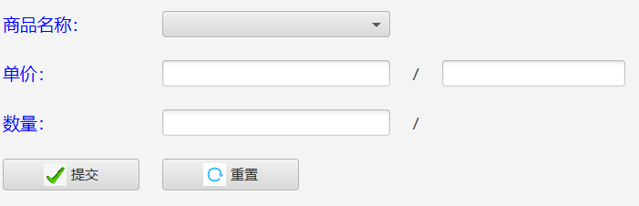

## 登录页

### 点击验证码图片
切换验证码

### 未输入验证码点击登录按钮

验证码输入框变红，验证码切换

### 验证码输入错误

弹窗提示，验证码输入框变红，验证码切换

### 不存在的用户名或密码

弹窗提示

### 正确的用户名、密码、验证码
登录界面关闭
进入用户对应的操作页面

### 修改
用户名、密码为空时弹窗提醒，清空验证码，使验证码输入框重新获取焦点。

## 销售页

### 不输入商品

弹出警告

### 选择商品

单价、单位和库存对应更新

### 点击重置
所有数据清空

### 非法数据

弹出警告（请输入正确的数据）

### 超出库存的销售量

弹出警告（添加失败）

### 正常数据

弹出提示（添加成功）、数据清空
销售表添加数据：
库存表修改库存：
存在问题：

库存没有被清空【已修复】

## 进货页

### 不选择供货商

弹出警告

### 输入已存在的商品名

对应单位自动填写

### 非法数据

弹出警告

### 添加不存在的货物

进货表：
货物表：

## 管理页

### 添加、修改为无名用户或无密码用户

【待修复】

### 删除、修改不选择用户
提示选择

### 导出不选择文件
提示选择

### 经理删除或修改管理员
提示无权限

### 销售页商品名不显示
【已修复】
