# 软件工程实习题目

请每个小组（6-7人）根据自己的情况和兴趣从以下题目中选择一个题目。

## 一、企业人力资源管理系统
基本功能要求：
- 员工信息管理：对企业员工的变动信息进行管理，如人员调入、调出、部门间调动、离退休处理等。可以查询企业员工的基本信息，员工的基本信息包括：姓名、年龄、性别、部门、岗位、工作证号、工作时间等。
- 考勤管理：对每位员工的出勤情况进行管理，管理员可以查询某一时期公司员工的上班、请假、加班、出差等出勤情况，并统计员工的实际工作时间。
- 工资管理：可自定义工资项目和参数，并根据员工的考勤状况，核算出员工的工资，生成工资总表和个人工资表。
- 报表管理：可以生成人事报表、员工考勤表、员工工资表等。可以多种方式输出结果（如以不同格式输出到文件中、预览报表、打印报表等）
- 系统管理：系统管理员使用，包括用户权限管理（增加用户、删除用户、密码修改等）、数据管理（提供数据修改、备份、恢复等多种数据维护工具）、系统运行日志、系统设置等功能。
- 系统帮助：提供操作指南。

可选功能（根据时间自己决定是否实现），如：
- 增加员工的种类，对不同种类员工管理不同的基本信息。
- 系统管理员可动态自定义员工信息的基本项，如系统管理员必要时可删除“工作证号”这一项，同时增加“身份证号”一项。对于这种类型的需求变化，整个系统不需要重新实现。

实现要求：
- 分析和设计时要具备所有功能。
- 编程实现时必须具备员工信息管理、考勤管理、工资管理以及系统管理中的用户管理功能。报表管理和系统管理中的数据管理、系统运行日志、系统设置可不实现；系统帮助尽量详细。
- 系统使用者包括超级用户和普通用户两类，超级用户可以使用全部功能，普通用户所能使用的功能由超级用户设置。

## 二、小型超市管理系统
基本功能要求：
1. 进货管理：根据进货单位进货。
2. 销售管理：每次销售都产生销售收据。
3. 报表管理：报表分进货报表、销售报表等；报表可以有多种格式可供选择；可以把报表输出到文件中，可以预览报表、打印报表等。
4. 系统管理：系统管理员使用，包括用户权限管理（增加用户、删除用户、密码修改等）、数据管理（提供数据修改、备份、恢复等多种数据维护工具）、系统运行日志、系统设置等功能。

可选功能（根据时间自己决定是否实现），如：
- 商品预定。
- 退货处理。
- 各种销售优惠措施，如根据顾客购买的商品数量或/和时间给予不同的价格。
- 对描述商品的基本信息可进行动态定制，如系统管理员在必要时可删除商品的“供货商”属性，同时增加“库存数量”属性。对于这种类型的需求变化，整个系统不需要重新实现。
- 其他自己觉得有必要实现的功能。

实现要求：
- 分析和设计时要具备所有功能。
- 商品的基本信息由自己确定，例如可以有价格、商品供应商、库存数量等属性。
- 系统的使用者包括顾客、采购员、售货员、总经理和系统管理员5种。系统管理员可以使用系统的所有功能，顾客、采购员、售货员、总经理所能使用的功能由系统管理员设置。
- 提供一定的安全验证机制，例如用户身份在登录时验证，不同用户对页面的访问权限不同。
- 系统编程实现时注意：
- 报表管理可以不用实现。
- 系统管理中的数据管理、系统运行日志、系统设置可以不用实现。

## 三、嵌入式软件系统的开发
“俄罗斯方块（Tetris）游戏是一个可运行在多种手机电话上的游戏软件。通过键盘和以GUI屏幕为中心的多媒体界面实现信息交互的要求。
这款游戏的规则简单，容易上手，且游戏过程变化无穷，有“容易“和”复杂“两种模式，用户可任选一种进行游戏。本系统还增加了积分制，既使用户能感受到游戏中的乐趣，又给用户提供了一个展现自己高超技艺的场所。由于手机容量有限，本系统只记录、存储每个用户最高的5条记录。该游戏的屏幕布局如图1所示。

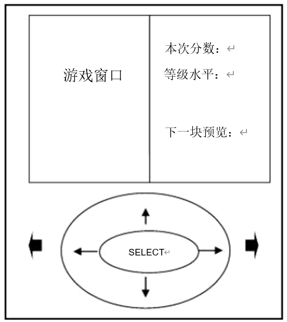
图1：游戏屏幕布局

游戏基本操作说明如下：
1. 按游戏界面的“开始”按钮或者确认键来开始游戏，使用左边的窗口玩游戏。
2. 键盘操作：系统默认设置使用方向键操作，“←”（或4）左移一格；“→”（或6）右移一格；“↓”（或8）方块下落；“↑”（或2）加速下落；“确认”键（或5）旋转方块；“1”键暂停/恢复游戏。
3. “计分牌”显示本次玩的分数。计分标准为：一次消1行得100分，消2行得200分，消3行得400分，消4行得800分。
4. “等级”反映用户游戏水平得设置等级，当分数达到一定的值，等级就会提升、速度加快，同时插入一行。
5. 打开游戏界面后，首先显示系统菜单。本系统包括4个子菜单项：“开始”、“操作说明”、“版本信息”和“返回”。用户选择“开始”后，即可进入下一级子菜单，显示“容易”、“复杂”两种游戏模式，“容易”模式只有7种形状的方块，而“复杂”则有17种方块。用户选择模式后，即可开始游戏。游戏机随机产生一个积木块开始下落，同时在右窗口下一步要下落的积木块，随着操作等级的提高（达到5级以上），系统会缩短下落的时间间隔，并定时插入一行，一增加难度。

实现要求：
1. 分析和设计时要具备所有功能，即重点在分析和设计。
2. 实现时“复杂”模式根据本组情况决定是否实现。

## 四、银行系统的开发
基本功能要求：银行是与生活紧密相关的一个机构，银行提供了存款、取款、转帐等业务。在银行设立帐户的人或机构通常被称为银行用户。一个客户可以在银行开多个帐户，客户可以存钱到帐户中，也可以从自己的帐户中取钱，还可以将存款从一个帐户转到另一个帐户。客户还可以随时查询自己帐户的情况，并查询以前所进行的存款、取款等交易记录。客户也有权利要求关闭帐户。
为了简化系统，本题目只考虑上述基本功能。

实现要求：
- 分析和设计时要具备所有功能。
- 编程实现时最好实现全部功能。

## 五、网上计算机销售系统
某计算机厂商准备开发一个“网上计算机销售系统”，以方便客户通过Internet购买计算机。客户可以通过Web页面登录进入“网上计算机销售系统”，通过Web页面查看、选择、购买标准配置的计算机。客户也可以选择计算机的配置或在线建立自己希望的配置。可配置的组件（如内存）显示在一个可供选择的表中。根据用户选择的每个配置，系统可以计算其价格。客户可选择在线购买计算机，也可以要求销售员在发出订单之前与自己联系，解释订单的细节，协商价格等。
客户在准备发出订单时，必须在线填写关于运送和发票地址及付款细节（支票和信用卡）表格，一旦订单被输入，系统向客户发送一份确认邮件，并附上订单细节。在等待计算机送到的时候，客户可以在线查询订单的状态。
后端订单处理的步骤是：验证客户的信用和付款方式，向仓库请求所购的计算机，打印发票并请求仓库将计算机运送给客户。在客户订单输入到系统后，销售员发送邮件请求给仓库，附上所订的配置细节。仓库从销售员那里获得发票，并给客户运送计算机。

实现要求：
- 分析和设计时要具备所有功能。
- 编程实现时“客户自己配置计算机”根据本组情况决定是否实现。

## 六、教师课堂辅助教学系统
本系统是教师能够集教学与学生情况记录于一体的综合课堂管理系统，以方便教师的教学过程，更加准确的了解学生情况。本系统主要包括以下功能：
通过课堂辅助教学系统，储存学生基本信息，完善课堂考勤制度（旷课、迟到、病假、早退和出勤），便于结果录入，及期末考勤汇总。
通过课堂辅助教学系统，记录教学过程中学生回答问题情况，引入奖励机制，提高学生学习积极性。
教师期末成绩统计及打印。
教学信息管理:包括课件、课程简介、课程教学大纲、课程考试大纲等。

实现要求：
- 分析、设计和编程实现全部功能。

## 七、档案管理系统
档案管理系统是一套功能强大、操作简便、实用的自动化管理软件，包括用户管理、档案数据录入（分为文件录入和案卷录入2部分）、案卷数据查询（分为文件查询和案卷查询2部分）、借阅管理等。可以应用于一般的档案室，也可以应用于网络中的办公系统，进行联网操作。
本档案管理系统主要针对某档案室对档案管理和业务管理的方便，以现代化的创新思维模式工作。

### （一）、下面概括一下本档案管理系统大致的功能需要。
1. 用户登录
   - 在用户进入系统前，首先要求用户进行，登录时要验证用户名和密码是否匹配，验证通过后允许用户进入本系统操作。
2. 修改注册信息
   - 用户登录后，可以修改自己的注册信息，包括修改用户密码、每页显示行数等信息，不允许修改用户名、姓名和部门等信息。
3. 权限设置
   - 本模块只有系统管理员可以操作。
   - 管理员可以增加系统用户、删除系统用户、修改用户的相关属性、修改用户的权限表。
4. 数据录入
   - 本模块处理用户输入新的档案文件信息或者档案案卷信息。
   - 输入数据时要考虑用户连续录入的情况，可以从上一条记录复制数据到新的记录中。
5. 数据维护
   - 本模块需要具有“数据维护”的权限的用户可以操作。
   - 数据维护模块对已经“删除”（只是做删除标记）的档案文件做最后判定，判断该文件是否需要删除。此模块涉及两种操作：恢复和彻底删除。
6. 数据查询
   - 按用户输入的条件查询相应的档案文件信息。
   - 查询结果以列表目录形式显示，也可以卡片形式显示。具有档案处理权限的用户可以对查询的结果编辑并保存，也可以“删除”（做删除标记）档案文件记录。
7. 数据修改
   - 本模块主要实现批量修改数据的功能，可以由用户指定条件，将数据库中所有符合条件的文件或案卷记录按要求修改某个字段的值。
   - 例如：可以指定将所有文件年份为“2002”的文件记录的保管期限改为“长期”。
8. 档案借阅
   - 此模块分为外借登记、归还记录和电子借阅申请处理两部分，具有“借阅管理”权限的用户可以操作此模块。外借模块实现档案文件的借出登记和归还登记功能。
   - 电子借阅申请由具有“借阅管理”权限的用户处理。一般用户提出阅读电子文档的请求后，被同意阅读后，文件将被发送给申请人。
   - 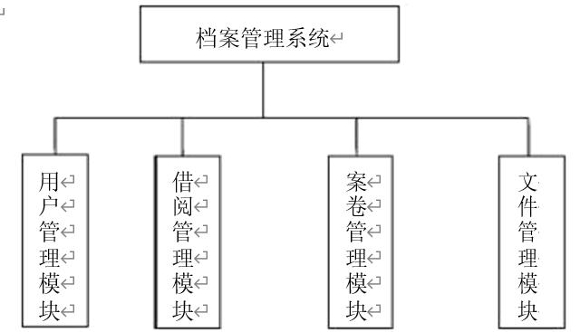

### （二）、用户管理模块
用户管理模块包括如图所示几个部分。
1. 添加用户：可以对用户进行添加操作。
2. 删除用户：管理员可以对已有用户进行删除操作。
3. 查看用户权限：每个用户都具有一定的权限，管理员可以查看用户的管理权限。
4. 修改管理权限：管理员可以修改用户的管理权限。
5. 添加管理权限：管理员在权限管理中可以添加管理权限。
6. 删除管理权限：管理员在权限管理中可以删除管理权限。

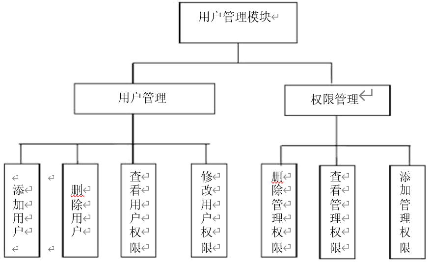

### （三）、借阅管理模块
借阅管理模块包括：
1. 借阅登记：输入借阅条件后就可以申请借阅登记。
2. 借阅查询：提供对所借出案卷的查询工作，对归还日期做详细说明。
3. 网上借阅：网上借阅又提供网上借阅申请、未提交的借阅申请、已处理的借阅申请、借阅申请处理和网上答复几个小模块。

其中网上借阅申请、未提交的借阅申请、已处理的借阅申请模块是所有用户都拥有的，借阅申请处理是具有借阅管理权限的用户所拥有的模块，网上答复是具有借阅答复权限的用户所拥有的模块。

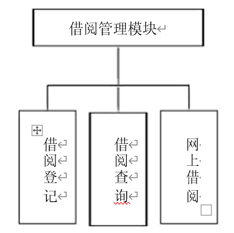

### （四）、案卷管理模块
案卷管理模块包括如下部分：
1. 案卷查询：对所需要的案卷进行查询操作。
2. 案卷录入：保存案卷。

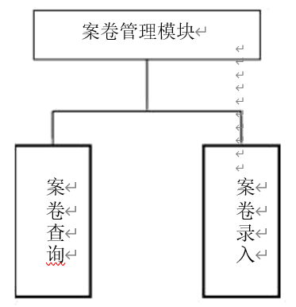

### （五）、文件管理模块
文件管理模块包括如下部分：
1. 文件查询：对所需的文件进行查询操作。
2. 文件录入：保存文件。

实现要求：
- 分析和设计时要具备所有功能。
- 编程实现时根据本组情况决定，但至少实现

## 八、BBS论坛系统

### （一）、系统功能需求：
一个基本的BBS论坛，可以大致分为以下流程：用户登录进入论坛（一般为游客，有时还要注册为会员），就某个话题（帖子的主题）展开讨论。通过发帖功能发布新的话题；通过回帖功能回复已有的话题；通过搜索功能查找已有的话题。管理员通过管理功能创建、编辑、删除论坛的版块；管理注册的用户；管理帖子。
这样的流程决定了BBS论坛系统的需要。

1. 会员注册
   - 提供新会员注册功能，包括提供录入信息的界面，检查注册信息的有效性，并将注册会员信息保存在对应数据库的数据表中。
2. 发表文章
   - 提供会员发表文章的功能，未注册用户不允许使用该功能。
3. 文章查询
   - 对注册会员和未注册会员提供文章查询以及阅读的功能，即提供对应文章标题信息，以及查看详细内容及回复文章的超链接。
4. 会员管理
   - 当网上论坛的会员完成注册后，系统会在数据库中加入会员的资料。包括会员名称、会员密码、会员E-mail等相关信息资料。同时，按照会员的不同身份，将特殊会员设置为版主，使他具备删除本讨论区中对应文章等特殊操作的权利。管理者可以依据数据库中注册的特殊身份登录到论坛后台对会员信息进行管理。
5. 论坛分类管理
   - 根据不同的讨论内容，管理员将整个讨论区划分成不同的区域，会员可以选择进入不同的讨论区，管理者对分类进行调整，同时提供不同讨论区中包括文章数量等的统计功能。
6. 帖子管理
   - 管理员和版主都可以对会员发表的帖子进行转移、置顶和删除等操作。系统总体功能需求框架图如下所示。
   - 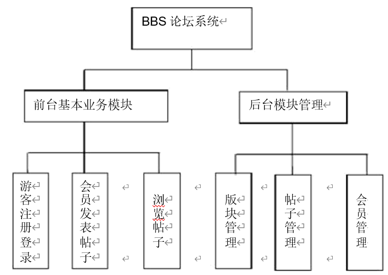

### （二）、前台基本业务模块
前台基本业务模块包含如图所示几个方面。

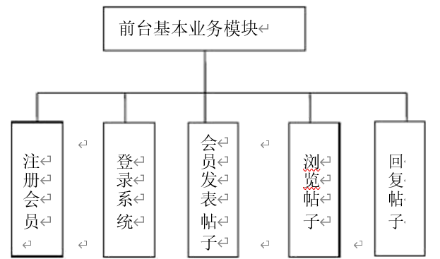

1. 注册会员
   - 提供新会员注册功能，包括提供录入信息的界面，检查注册信息的有效性，并将注册会员信息存入对应数据库的数据表。
2. 登录系统
   - 提供会员登录论坛功能。要想针对某篇帖子发言，或发表帖子，必须是登录用户才可以操作。由于论坛中某些操作只有会员才可以执行，所以必须先登录系统。
3. 浏览帖子
   - 对注册会员和未注册会员提供文章查询以及阅读的功能，即提供对应文章标题信息，以及查看详细内容及回复文章的超链接。
4. 会员发表帖子
   - 会员可以针对某个感兴趣的话题发表自己独到的见解。未注册用户无此项功能。
5. 回复帖子
   - 注册会员和未注册会员都可以对某一话题展开讨论，发表意见，并给出回复。

### （三）、后台管理模块
后台管理模块主要包括对整个BBS论坛系统的设置管理，包含如下所示的几个方面。
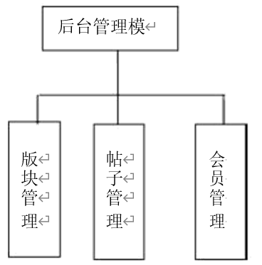

1. 版块管理
   - 根据不同的话题，管理员可以将每个话题分成不同的种类版块，然后对其进行管理。管理员可以删除认为不必要的版块话题；管理员可以修改版块的主题名、类型和数量等；管理员还可以添加新的版块。
2. 帖子管理
   - 管理员可以对会员发表的帖子进行管理。管理员可以删除内容反动或不健康的帖子，可以置顶帖子。还可以设置精华帖，控制帖子的点击率等操作。
3. 会员管理
   - 管理员可以对会员进行管理。可以删除会员，收回他的会员号；修改会员的基本信息，修改会员的积分，排行等。

- 分析和设计时要具备所有功能。
- 编程时最好实现所有功能模块。

## 九、新闻中心管理系统

### （一）、系统功能要求
新闻中心管理系统主要是为了实现某些企业商务网站实时动态新闻的显示及管理的系统。一个典型的新闻中心管理系统一般都会提供新闻标题分类显示、新闻详细内容显示等功能。同时也应该为新闻中心后台管理的管理员提供对应的新闻信息维护及管理的功能，其中包括添加新的新闻，编辑修改新闻、删除新闻等功能。
根据企业商务新闻的基本要求，本系统需要完成的主要任务如下：

1. 新闻标题信息分类显示
   - 在进入新闻中心主页时，应该能够根据数据库中存放的信息分类显示最新的新闻标题。因为本系统的新闻类型分为两类，一类是热点新闻，另一类是行业新闻。如在热点新闻中显示所有最新的标题信息，在行业新闻中显示最新标题信息。每个新闻标题都应该提供对应的超链接，用户单击这个新闻标题后，就可以跳转到有关该新闻详细内容的页面上，让用户对这个新闻有更详细的了解。
2. 新闻详细内容及相关新闻列表显示
   - 当单击某个新闻标题后，应该可以查看该新闻的详细内容。同时提供与该新闻相关的新闻标题信息的显示，以便于客户查询与该新闻相关的其他信息。
3. 新闻中心后台管理功能
   - 新闻中心的管理员可以根据企业的需要随时向数据库中添加最新的新闻标题及相关内容。还可以随时删除过时的新闻及内容，以及对一些原有新闻做必要的修改。
   - 该系统的功能可以分为两大模块：信息浏览模块和后台管理模块。

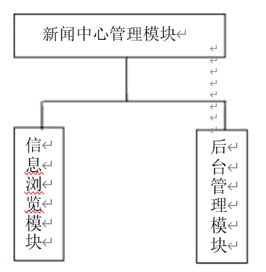

### （二）、信息浏览模块
信息浏览模块包含如下所示的几个方面。
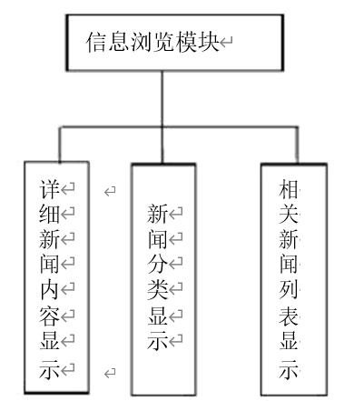

1. 新闻分类显示
   - 负责将新闻标题显示给客户端，并提供新闻标题的超链接。
2. 详细新闻内容显示
   - 负责新闻内容的显示。
3. 相关新闻列表显示
   - 负责在具体新闻内容显示的同时提供其他新闻标题列表的显示功能。

### （三）、后台管理模块包含如下所示的几个方面。
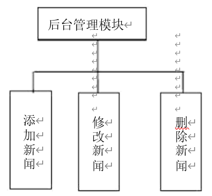

1. 添加新闻
   - 负责添加新的新闻到新闻中心。
2. 修改新闻
   - 负责对现有新闻进行修改。
3. 删除新闻
   - 负责删除新闻中心过时的新闻。
   - 分析和设计时要具备所有功能。
   - 编程时最好实现所有功能模块。

## 十、学生成绩管理系统
功能描述：在学生成绩管理系统中，系统的用户只有2个：教师和学生。
教师登录系统后可以记录学生的成绩，查看学生的成绩和打印学生的成绩。学生登录系统后可以查看成绩。
分析、设计时要具备所有功能。
